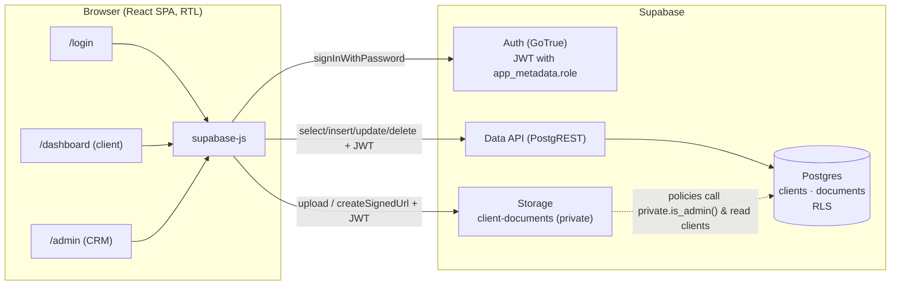

# Architecture

Related: [[Database-Schema]] · [[Setup-Guide]] · [[Home]]

## Overview

InvestCRM is a **single-page React app** (Vite + TypeScript, Tailwind CSS, Recharts) that talks **directly to Supabase** from the browser with the public *publishable/anon* key. No custom backend. **Authorization is enforced in Postgres** by Row Level Security and Storage policies, so the frontend only decides what to *show*, never what a user is *allowed* to do.



## Roles & auth flow

1. The user signs in with email + password (`supabase.auth.signInWithPassword`).
2. Supabase issues a JWT. The user's role lives in **`app_metadata.role`** (`admin` or `client`), which only the server or service role can change.
3. The SPA reads `session.user.app_metadata.role` (`src/context/AuthContext.tsx`) to route:
   - `admin` → `/admin`
   - anyone else → `/dashboard`
4. Every query carries the JWT. Postgres policies call `private.is_admin()` (reads the same claim) and `auth.uid()`.

> [!warning] Why not `user_metadata`?
> `user_metadata` can be edited by the user (`supabase.auth.updateUser({ data })`). If policies trusted it, any client could promote themselves to admin. Only `app_metadata` is used for authorization.

Route guards (`src/components/ProtectedRoute.tsx`) are only for UX. A client who forces their way to `/admin` still gets nothing back, because RLS returns only their own row and blocks writes.

## CRM integration: linking clients to users

An admin can create a client record **before** that person has an account ("pending", `user_id = NULL`). Two `security definer` triggers keep `clients.user_id` in sync by **email**:

| Event | Trigger | Effect |
|---|---|---|
| New auth user signs up | `on_auth_user_created_link_client` on `auth.users` | Links any pending client row with the same email |
| Admin inserts a client whose email already has an account | `clients_link_existing_user` on `public.clients` | Fills `user_id` immediately |

The admin table shows this as **מחובר** (linked) and **ממתין** (pending).

## Documents

- Files live in the private bucket `client-documents` at `{client_id}/{timestamp}-{ascii_safe_name}`.
- The original (often Hebrew) filename is kept in `documents.file_name`.
- Upload (admin): Storage `upload`, then insert a `documents` row. If the row insert fails, the object is removed.
- View/download (admin or owning client): `createSignedUrl(path, 60)`, a 60-second URL. Storage policies decide whether signing is allowed.
- Deleting a client removes its storage folder, then the row. `documents` rows go with it through `ON DELETE CASCADE`.

## Finance model (`src/lib/finance.ts`)

Monthly compounding with end-of-month deposits:

$$FV = P(1+i)^n + PMT \cdot \frac{(1+i)^n - 1}{i}, \qquad i = \frac{r}{12}$$

- `P` = `initial_investment`, `PMT` = `monthly_deposit`, `r` = `expected_annual_return / 100`, `n` = months.
- `r = 0` falls back to `P + PMT·n`.
- **Current portfolio value** = FV at months elapsed since `created_at` (capped at the plan length). This is an *estimate* that assumes the expected return was achieved.
- **Chart** = yearly points `{deposited, value}` from year 0 to `investment_years`.

### Admin metrics
| Metric | Definition |
|---|---|
| Total AUM | Σ current estimated value of every client |
| Avg monthly deposit | mean of `monthly_deposit` |
| Projected value at horizon | Σ FV at each client's `investment_years` |
| Projected growth | (Σ projected value − Σ projected deposits) / Σ projected deposits |

## Frontend layout

```
src/
  lib/          supabase client, types, finance math, he-IL formatters
  context/      AuthContext (session + role)
  i18n/         translations (he / en), LanguageContext (lang, dir, t, fmt)
  components/   Layout, ProtectedRoute, StatCard, GrowthChart, DocumentsList,
                ClientFormModal, DocumentsModal, Modal/ConfirmDialog, Spinner,
                LanguageSwitcher
  pages/        LoginPage, DashboardPage, AdminPage (lazy-loaded)
```

## Languages (Hebrew / English)

The UI ships in **Hebrew (default, RTL)** and **English (LTR)**. You can switch with the `LanguageSwitcher` on the login page and in the app header.

- `src/i18n/translations.ts` holds one dictionary per language. `en` is typed as `Dict = typeof he`, so a missing or extra key is a compile error. Strings with parameters are functions (e.g. `t.admin.summary(n, linked, pending)`).
- `LanguageProvider` (`src/i18n/LanguageContext.tsx`) exposes `{ lang, setLang, t, dir, fmt }`. It sets `<html lang dir>` and `document.title`, and saves the choice in `localStorage` under `investcrm.lang`.
- `fmt` holds `Intl` formatters for the active locale (`he-IL` / `en-US`): currency is always ₪ (ILS), and dates and percentages follow the locale.
- A tiny inline script in `index.html` applies the saved direction before first paint, so there is no RTL→LTR flash.
- Data (client names, file names) is never translated. User-supplied names inside sentences are wrapped in Unicode bidi isolates (`\u2068…\u2069` / `<bdi>`) so Hebrew names display correctly in English text and vice versa.

Layout uses Tailwind logical utilities (`ms-/me-`, `ps-/pe-`, `start-/end-`, `text-start/end`) throughout, so each component mirrors automatically when `dir` changes. The Heebo font covers both scripts. The chart plot is always rendered `dir="ltr"` so time reads left→right, as in standard financial charts. Its tooltip follows the page direction.
