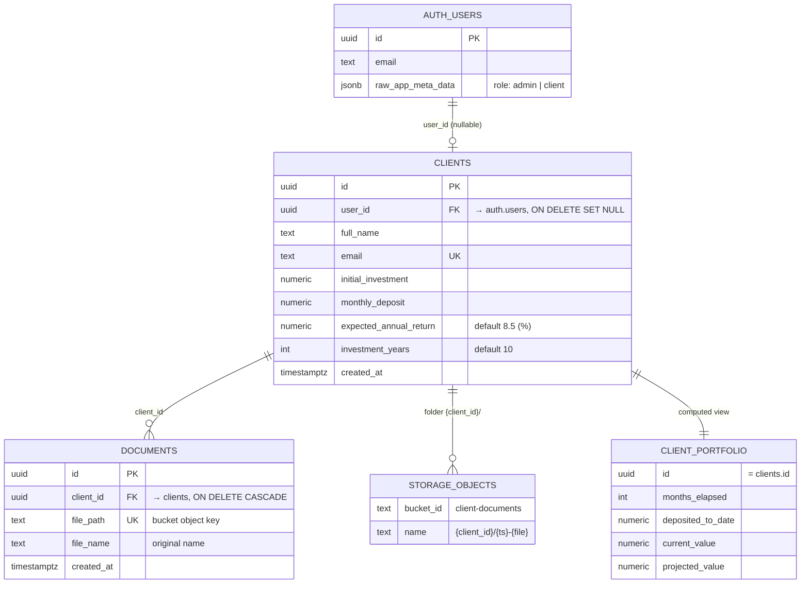

# Database Schema

Related: [[Architecture]] · [[Setup-Guide]] · [[Home]]

Migrations live in `supabase/migrations/`:

| File | Contents |
|---|---|
| `20260923114800_schema.sql` | `clients`, `documents` tables and indexes |
| `20260923114801_security.sql` | `private` schema, `is_admin()`, grants, RLS policies, auto-link triggers |
| `20260923114802_storage.sql` | `client-documents` bucket and Storage policies |
| `20260923122533_portfolio_views.sql` | `future_value()` function, `client_portfolio` and `portfolio_summary` views |
| `supabase/seed.sql` | Demo auth users and sample clients |

## ERD



## Tables

### `public.clients`
| Column | Type | Notes |
|---|---|---|
| `id` | `uuid` PK | `gen_random_uuid()` |
| `user_id` | `uuid` → `auth.users.id` | `NULL` = pending client; `ON DELETE SET NULL`; indexed |
| `full_name` | `text` | required |
| `email` | `text` **unique** | used to link to an auth user |
| `initial_investment` | `numeric(14,2)` | ≥ 0 |
| `monthly_deposit` | `numeric(14,2)` | ≥ 0 |
| `expected_annual_return` | `numeric(5,2)` | percent, default **8.5**, between −100 and 100 |
| `investment_years` | `integer` | default **10**, 1–60 |
| `created_at` | `timestamptz` | `now()`; start date for "current value" |

### `public.documents`
| Column | Type | Notes |
|---|---|---|
| `id` | `uuid` PK | |
| `client_id` | `uuid` → `clients.id` | `ON DELETE CASCADE`; indexed |
| `file_path` | `text` unique | key inside `client-documents` |
| `file_name` | `text` | display name (may be Hebrew) |
| `created_at` | `timestamptz` | |

## Portfolio views (computed, read-only)

The tables store only each client's **plan**. The money figures the app shows are calculated, and the same calculation is available in the database through two views, so you can inspect it in the Table Editor (`schema public` → `client_portfolio` / `portfolio_summary`) or query it with SQL.

| Object | What it returns |
|---|---|
| `public.future_value(initial, monthly, annual_return_pct, months)` | Compound-interest FV: monthly compounding with end-of-month deposits. Same formula as `futureValue()` in `src/lib/finance.ts` |
| `public.client_portfolio` | One row per client: plan columns plus `months_elapsed`, `deposited_to_date`, `current_value`, `projected_deposited`, `projected_value` |
| `public.portfolio_summary` | One row: `clients`, `linked_clients`, `total_aum`, `total_deposited_to_date`, `avg_monthly_deposit`, `total_projected_value`, `total_projected_deposited`, `projected_growth_pct` (the admin metrics header) |

- Both views use **`security_invoker = true`**, so they run with the caller's rights and the `clients` RLS policies still apply. An admin sees every client and the totals for all of them. A client sees only their own row, and their "summary" covers just themselves. `anon` has no access.
- Nothing is stored. Values are recalculated on every read, so editing a client's plan updates the views immediately.
- `months_elapsed` counts whole calendar months since `created_at`, capped at `investment_years × 12`, the same rule as the app. The database evaluates it in UTC and the browser in local time, so the two can differ by one month for a few hours around a month boundary.

```sql
select full_name, deposited_to_date, current_value, projected_value
from client_portfolio
order by current_value desc;

select total_aum, avg_monthly_deposit, total_projected_value, projected_growth_pct
from portfolio_summary;
```

## Role helper

```sql
create function private.is_admin() returns boolean
language sql stable security invoker set search_path = ''
as $$ select coalesce((auth.jwt() -> 'app_metadata' ->> 'role') = 'admin', false) $$;
```

- It lives in the **`private`** schema, which the Data API doesn't expose, so it can't be called as an RPC.
- It is `security invoker`: it only reads the caller's JWT and needs no extra privileges.
- Policies call it as `(select private.is_admin())` so Postgres evaluates it **once per query** rather than once per row.

## Row Level Security

RLS is **enabled** on both tables. `anon` has no privileges at all. `authenticated` has table grants, and the policies below narrow them.

### `clients`
| Policy | Command | Rule |
|---|---|---|
| read own record or admin | `SELECT` | `user_id = auth.uid() OR is_admin()` |
| admin insert | `INSERT` | `WITH CHECK is_admin()` |
| admin update | `UPDATE` | `USING is_admin() WITH CHECK is_admin()` |
| admin delete | `DELETE` | `USING is_admin()` |

### `documents`
| Policy | Command | Rule |
|---|---|---|
| read own or admin | `SELECT` | `is_admin() OR client_id IN (SELECT id FROM clients WHERE user_id = auth.uid())` |
| admin insert / update / delete | `INSERT` `UPDATE` `DELETE` | `is_admin()` |

Result: a **client** can read exactly one `clients` row (their own) and that row's documents. Every write they try is rejected or affects 0 rows. An **admin** has full CRUD.

## Storage: bucket `client-documents`

Private bucket (`public = false`), 20 MB per-file limit. Object key convention: `{client_id}/{timestamp}-{safe_name}`.

| Policy (on `storage.objects`) | Command | Rule |
|---|---|---|
| admin select / insert / update / delete | all | `bucket_id = 'client-documents' AND is_admin()` |
| client reads own folder | `SELECT` | `bucket_id = 'client-documents' AND (storage.foldername(name))[1] IN (SELECT id::text FROM clients WHERE user_id = auth.uid())` |

Admins have SELECT + INSERT + UPDATE, which upsert needs. Clients can only `SELECT` objects in their own folder, and that same permission is what lets them create signed URLs.

## Triggers (auto-linking)

| Trigger | Table | Function | Purpose |
|---|---|---|---|
| `on_auth_user_created_link_client` | `auth.users` AFTER INSERT | `private.link_client_on_signup()` | Set `clients.user_id` for pending rows with matching email |
| `clients_link_existing_user` | `public.clients` BEFORE INSERT | `private.link_user_on_client_insert()` | Fill `user_id` if an account with that email already exists |

Both are `security definer` with `search_path = ''`. They live in `private`, and `EXECUTE` is revoked from `public`/`anon`/`authenticated`, so they only run as triggers.

## Verifying policies

`npm run verify:rls` (`scripts/verify-rls.mjs`) signs in as both demo users and checks:
- anon can't read, client sees 1 row, client can't insert or update
- admin reads all rows and can insert and delete
- admin can upload to any folder; client can sign their own file but not another client's, and can't upload
- client sees only their own row in `client_portfolio` / `portfolio_summary`; admin sees all; anon is denied
